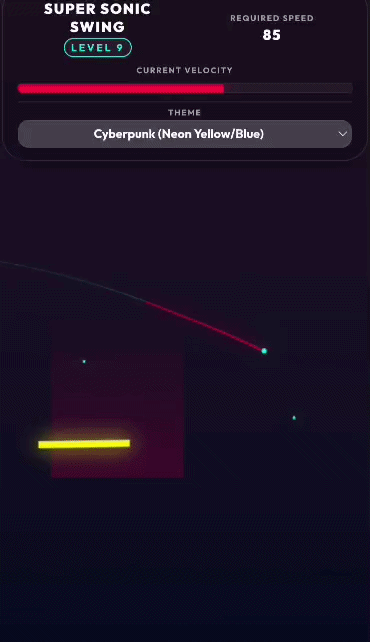
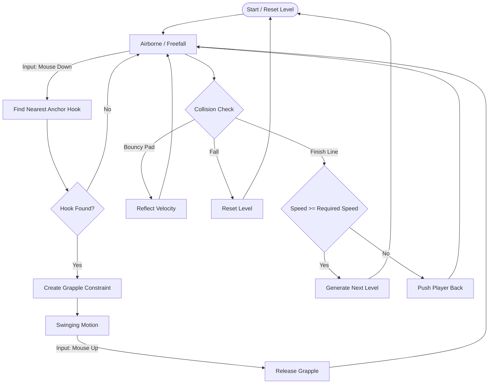

# Super Sonic Swing 🕸️

  

**Super Sonic Swing** is a fast-paced physics-based 2D grappling game built with **HTML5 Canvas** and **Matter.js**.

The goal is simple: build enough momentum to **break the sound barrier** and cross the finish line at **supersonic speed**.

---

## Contents

- [How to Play](#how-to-play)
- [Features](#features)
- [Core Gameplay Flow](#core-gameplay-flow)
- [Game Mechanics and Physics](#game-mechanics-and-physics)
- [Setup and Installation](#setup-and-installation)
- [Tech Stack](#tech-stack)
- [License](#license)

---

# How to Play 🎮

### Objective

Reach the finish line at the **far right side of the level**.

### The Catch

You must cross the finish line with speed **greater than or equal to the required speed**.  
If your speed is too low, the game will **bounce you backward** so you must try again.

### Controls

**Mouse / Touch Down**

Attach a grapple hook to the nearest anchor.

**Mouse / Touch Up**

Release the grapple and launch forward.

### Themes

Choose from four visual styles:

- Synthwave
- Cyberpunk
- Minimal Dark
- Minimal Light

---

# Features ✨

### Procedural Level Generation

Levels extend infinitely and become progressively harder.

### Custom Physics System

The game uses a tuned physics system with gravity, air resistance, and momentum.

### Dynamic Visual Effects

- Speed based camera zoom
- Motion trails
- Screen shake
- Mach cone shockwave when breaking the sound barrier

### Environmental Mechanics

The world contains interactive physics elements:

- Bouncy pads
- Anti-gravity zones
- Wind tunnels

---

# Core Gameplay Flow 🔄

---

# Game Mechanics and Physics ⚙️

The game builds additional physics mechanics on top of the **Matter.js rigid body engine**.

---

## 1. Grapple Constraint

When a player clicks, the nearest hook is detected and a **spring constraint** is created between:

Player `P` and Hook `H`.

Physics parameters:

`stiffness = 0.2`  
`damping = 0.05`

This force pulls the player toward the anchor point and produces the swinging motion.

---

## 2. The Yank (Attach Boost)

When a grapple successfully attaches, the player's velocity receives a multiplier boost.

`v_new = v_current × λ`

where `λ = 1.1`.

Chaining grapples increases speed exponentially.

---

## 3. The Fling (Release Boost)

First compute the normalized velocity direction:

`v̂ = v_current / |v_current|`

Then apply the release boost:

`v_new = v_current + (v̂ × F_fling)`

where `F_fling = 15`.

---

## 4. Supersonic Drag (Air Wall)

If the player exceeds the required speed:

`|v| ≥ V_req`

Velocity is reduced each physics frame:

`v_new = v_current × μ_drag`

where

`μ_drag = 0.998`

Physics timestep:

`Δt = 16.6 ms`.

---

## 5. Dynamic Difficulty Scaling

Required speed increases with level:

`V_req(L) = V_base + (L − 1) × 5`

where

`V_base = 45`.

---

## 6. Dynamic Camera Zoom

First compute velocity ratio:

`ratio = min(|v| / V_base , 2.5)`

Target zoom:

`Z_target = max(1 − (ratio × 0.3), 0.25) × Scale_base`

Smooth interpolation:

`zoom = lerp(currentZoom , Z_target , 0.02)`

---

# Setup and Installation 🛠️

The game is contained in a **single HTML file**.

Steps:

1. Clone or download the repository
2. Open `index.html` in a modern browser

Recommended local server:

`python -m http.server`

or **VS Code Live Server**.

---

# Tech Stack 🏗️

### HTML / CSS

UI layout, styling, overlay animations.

### JavaScript (ES6)

Game logic, procedural generation, rendering loop.

### Canvas API

High-performance rendering with separate environment and particle layers.

### Matter.js

Rigid body physics engine handling:

- collision detection
- constraints
- gravity
- physics simulation

---

# License 📄

© 2026 **Shounak Das**

All Rights Reserved.

This software and its documentation may **not be copied, modified, or distributed** without explicit permission.
