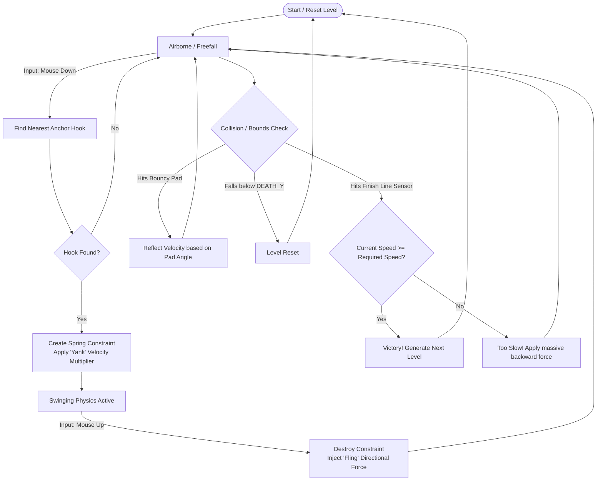

# Super Sonic Swing

**Super Sonic Swing** is a fast-paced, physics-based 2D grappling game built entirely with **HTML5 Canvas** and **Matter.js**.  
The objective is to build enough momentum to break the **sound barrier** and cross the finish line at **supersonic speeds**.

---

# 📑 Table of Contents

- [How to Play](#-how-to-play)
- [Features](#-features)
- [Core Gameplay Flow](#-core-gameplay-flow)
- [Game Mechanics & Physics Equations](#-game-mechanics--physics-equations)
- [Setup & Installation](#-setup--installation)
- [Tech Stack](#-tech-stack)
- [License & Copyright](#-license--copyright)
---

# 🎮 How to Play

**Objective:**  
Cross the finish line at the far right of the level.

**The Catch:**  
You must be traveling at or above the **Required Speed** when crossing the line. Otherwise you will be forcefully bounced backward and must try again.

**Controls:**

Mouse / Touch Down  
Attach a grapple hook to the nearest anchor point.

Mouse / Touch Up  
Release the grapple line to fling yourself forward.

**Themes**

Choose between **4 premium color palettes**:

- Synthwave
- Cyberpunk
- Minimal Dark
- Minimal Light

These can be selected via the in-game UI.

---

# ✨ Features

**Procedural Level Generation**  
Levels extend infinitely and become progressively harder.

**Custom Physics**  
Fine-tuned gravity, air friction, and restitution parameters.

**Dynamic Visual Effects**

- Speed-based camera zoom
- Motion trails
- Screen shake
- Mach cone shockwaves when breaking the sound barrier

**Environmental Hazards and Aids**

- Bouncy pads
- Anti-gravity zones
- Wind tunnels

---

# 🔄 Core Gameplay Flow

The following diagram shows the gameplay input and physics loop.



---

# ⚙️ Game Mechanics & Physics Equations

Super Sonic Swing uses custom physics impulses on top of the **Matter.js rigid body engine**.

---

## 1. Grapple Constraint

When the user clicks, the nearest hook is detected and a **Spring Constraint** is created between:

Player **P** and Hook **H**

Matter.js internally applies **Hooke's Law**.

Parameters:

```
stiffness k = 0.2
damping c = 0.05
```

This pulls the player toward the anchor point.

---

## 2. The "Yank" (Attach Boost)

To keep gameplay fast, attaching to a hook boosts the player's velocity.

Let:

```
λ = swingBoostMult = 1.1
v = current velocity
```

If the player is already moving:

```
v_new = v_current × λ
```

This allows **chained swings to exponentially increase speed**.

---

## 3. The "Fling" (Release Boost)

When the player releases the grapple, the constraint is destroyed and an additional directional force is applied.

Let:

```
F_fling = releaseBoost = 15
v̂ = normalized velocity vector
```

```
v̂ = v_current / |v_current|

v_new = v_current + (v̂ × F_fling)
```

This simulates actively **throwing yourself forward**.

---

## 4. Supersonic Drag (Air Wall)

To prevent infinite speed, drag is applied when the player exceeds the required speed.

If

```
|v| ≥ V_req
```

then each physics frame:

```
v_new = v_current × μ_drag
```

Where

```
μ_drag = 0.998
```

Physics timestep:

```
16.6 ms
```

---

## 5. Dynamic Difficulty Scaling

Each level increases the required speed.

```
V_req(L) = V_base + (L − 1) × 5
```

Where

```
V_base = 45
```

---

## 6. Dynamic Camera Zoom

The camera zooms out as speed increases.

```
Ratio = min(|v| / V_base , 2.5)

Z_target = max(1.0 − (Ratio × 0.3), 0.25) × Scale_base
```

The camera zoom smoothly interpolates toward this value:

```
LERP factor = 0.02 per frame
```

This creates a cinematic zoom effect during high-speed gameplay.

---

# 🛠️ Setup & Installation

The entire game is contained in a **single HTML file**.

No bundlers or build tools are required.

Steps:

1. Clone or download this repository.
2. Open `index.html` in any modern browser.

For best performance run using a local server.

Examples:

```
VSCode Live Server
```

or

```
python -m http.server
```

---

# 🏗️ Tech Stack

**HTML / CSS**

- UI rendering
- styling
- overlay animations

**JavaScript (ES6)**

- gameplay logic
- procedural generation
- render loop

**Canvas API**

- high performance rendering
- background layer
- player + particle layer

**Matter.js**

- rigid body physics
- collision handling
- constraints
- gravity simulation

---

# 📄 License & Copyright

© 2026 **Shounak Das**

All Rights Reserved.

This software and its associated documentation may **not be copied, modified, or distributed** without express permission.